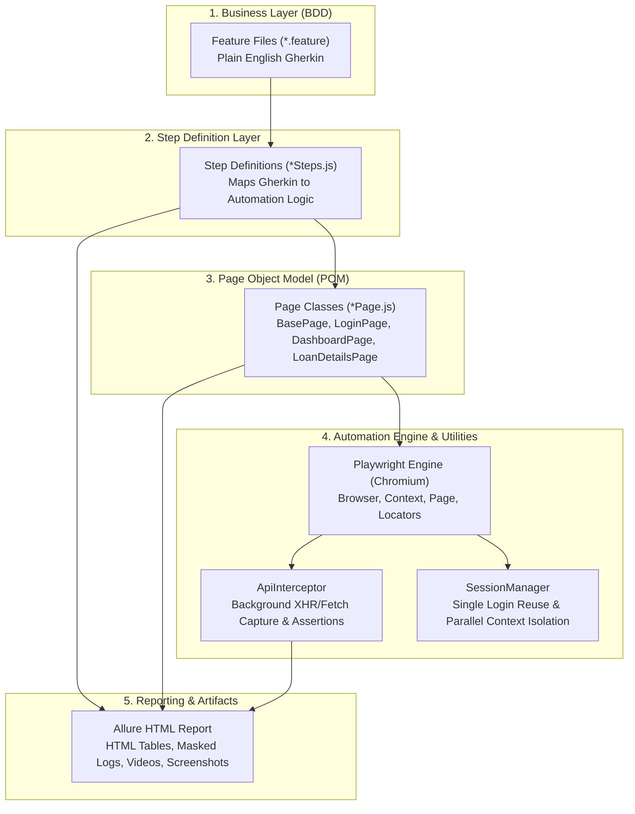

# 🚀 Complete Framework Explanation & Code Walkthrough Guide
### Designed for Beginners, Manual QA Engineers, and Automation Developers

---

## 📌 Table of Contents
1. [Overview & Philosophy](#1-overview--philosophy)
2. [High-Level Architecture Diagram](#2-high-level-architecture-diagram)
3. [Folder Structure & Component Roles](#3-folder-structure--component-roles)
4. [Execution Flow (Step-by-Step)](#4-execution-flow-step-by-step)
5. [Deep Dive: Core Files & Code Walkthrough](#5-deep-dive-core-files--code-walkthrough)
   - [A. Feature Files (`features/`)](#a-feature-files-features)
   - [B. Step Definitions (`steps/`)](#b-step-definitions-steps)
   - [C. Page Object Model (`pages/`)](#c-page-object-model-pages)
   - [D. Network & API Interceptor (`utils/apiInterceptor.js`)](#d-network--api-interceptor-utilsapiinterceptorjs)
   - [E. Session Management & Parallelism (`utils/sessionManager.js`)](#e-session-management--parallelism-utilssessionmanagerjs)
   - [F. Cucumber Hooks & Reporting (`support/hooks.js`)](#f-cucumber-hooks--reporting-supporthooksjs)
6. [Security & Masking](#6-security--masking)
7. [Reporting & Failure Artifacts](#7-reporting--failure-artifacts)
8. [Quick Reference Cheatsheet & Commands](#8-quick-reference-cheatsheet--commands)

---

## 1. Overview & Philosophy

This automation testing framework is built using:
- **Playwright**: Fast, reliable browser automation with auto-waiting, network interception, and video recording.
- **Cucumber (BDD - Behavior Driven Development)**: Allows tests to be written in plain English Gherkin syntax (`Given`, `When`, `Then`), making test cases easily understandable for Product Owners, Business Analysts, and Manual Testers.
- **Page Object Model (POM)**: Separates test logic (steps) from application UI implementation (locators and clicks), ensuring easy maintenance.
- **Allure Reporting**: Generates interactive HTML test execution reports with embedded screenshots, failed test videos, API payload summaries, and colored pass/fail badges.

---

## 2. High-Level Architecture Diagram



---

## 3. Folder Structure & Component Roles

```
Playwright_BDD_POC-main/
│
├── config/
│   └── env.js                   # Central environment variables & browser/video settings
│
├── features/                    # Plain English BDD test scenarios
│   ├── login.feature            # 1. User Authentication scenarios
│   ├── loanSearch.feature       # 2. Loan Search on Dashboard scenarios
│   ├── loanDetailsTabs.feature  # 3. 14-Tab Multi-Tab verification
│   └── loanSearchApiValidation.feature # 4. API response payload & field checks
│
├── steps/                       # Step definition JavaScript files
│   ├── loginSteps.js            # Steps for login & authentication
│   ├── dashboardSteps.js        # Steps for dashboard search
│   ├── loanDetailsSteps.js      # Steps for multi-tab verification & HTML tables
│   └── apiValidationSteps.js    # Steps for API response status & JSON verification
│
├── pages/                       # Page Object classes (UI locators & actions)
│   ├── BasePage.js              # Parent class with reusable click, fill & wait methods
│   ├── LoginPage.js             # Actions for Insight Login screen
│   ├── DashboardPage.js         # Actions for Dashboard & Search dropdown
│   └── LoanDetailsPage.js       # Actions for 14 tabs & "More" dropdown
│
├── support/                     # Cucumber framework hooks and world context
│   ├── world.js                 # Shared Cucumber context (CustomWorld)
│   ├── hooks.js                 # Before/After scenario & step failure hooks
│   └── allureReporter.js        # Formats Cucumber events for Allure
│
├── utils/                       # Reusable utility modules
│   ├── logger.js                # Timestamped, masked console logger
│   ├── apiInterceptor.js        # Network XHR/Fetch listener & JSON parser
│   └── sessionManager.js        # Worker sessions & browser lifecycle
│
├── reports/                     # Output artifacts (ignored in Git)
│   ├── screenshots/             # Full-page PNG screenshots on step failure
│   └── videos/                  # .webm video recordings for failed tests
│
├── cucumber.js                  # Master Cucumber profile configuration
└── package.json                 # Project dependencies & npm test scripts
```

---

## 4. Execution Flow (Step-by-Step)

When you run `npm test`, the framework executes in this precise lifecycle:

1. **Bootstrap & Profile Selection (`cucumber.js`)**:
   - Loads environment configuration from `.env`.
   - Reads the ordered feature files in sequence:
     1. `login.feature`
     2. `loanSearch.feature`
     3. `loanDetailsTabs.feature`
     4. `loanSearchApiValidation.feature`
2. **`Before` Hook Triggered (`support/hooks.js`)**:
   - `CustomWorld` initializes (`support/world.js`).
   - `SessionManager` launches Chromium in maximized view.
   - Performs a single automated login and establishes an active authenticated session.
3. **Scenario Steps Execution (`steps/*Steps.js`)**:
   - Step definitions call methods in `pages/*Page.js`.
   - `BasePage` automatically waits for elements, handles spinners, and masks sensitive data.
   - `ApiInterceptor` listens to all background network calls in real time.
4. **`AfterStep` Hook**:
   - If a step passes, it continues.
   - If a step fails, it instantly takes a full-page PNG screenshot and attaches it to Allure.
5. **`After` Hook**:
   - If the scenario **passed**: Deletes the temporary video to save disk space.
   - If the scenario **failed**: Flushes the high-definition video (`.webm`) to disk and attaches it to Allure.
6. **Report Generation**:
   - `allure generate` compiles test data into an interactive web report.

---

## 5. Deep Dive: Core Files & Code Walkthrough

### A. Feature Files (`features/`)
Feature files describe test scenarios using Gherkin syntax:
- **`Given`**: Sets up the initial context (e.g. `Given I am on the dashboard`).
- **`When`**: Represents an action taken by the user (e.g. `When I search for Loan ID "555835905"`).
- **`Then`**: Asserts the expected outcome (e.g. `Then the API response status code should be 200`).
- **`And`**: Extends the previous step (e.g. `And the API response field "Address" from "/DataApi/Info/InfoById/" should contain "110 Main Street"`).

---

### B. Step Definitions (`steps/`)
Connects Gherkin sentences to JavaScript actions.

**Example from [`steps/apiValidationSteps.js`](file:///d:/Technical/POC/Playwright/nzPoc/Playwright_BDD_POC-main/steps/apiValidationSteps.js):**
```javascript
When('I search for Loan ID {string} with API response capture', async function (loanId) {
  // 1. Attach interceptor to monitor background network traffic
  this.apiInterceptor = new ApiInterceptor(this.page);
  this.apiInterceptor.startCapture();

  // 2. Perform search on UI
  await this.dashboardPage.fillSearch('loanid', loanId);
  await this.dashboardPage.submitSearch();

  // 3. Stop capturing and log results
  await this.page.waitForTimeout(1000);
  await this.apiInterceptor.stopCapture();
});
```

---

### C. Page Object Model (`pages/`)
Page objects encapsulate locators and user interactions.

**Example from [`pages/BasePage.js`](file:///d:/Technical/POC/Playwright/nzPoc/Playwright_BDD_POC-main/pages/BasePage.js):**
```javascript
async fill(selector, value) {
  // Automatically mask passwords from terminal logs
  const isSensitive = /pass|pwd|secret|token|pin/i.test(selector);
  const displayVal = isSensitive ? '********' : value;
  logger.step(`Filling "${selector}" with "${displayVal}"`);

  // Wait for element to be visible before typing
  await this.page.locator(selector).waitFor({ state: 'visible', timeout: ENV.timeouts.element });
  await this.page.locator(selector).fill(value);
}
```

---

### D. Network & API Interceptor (`utils/apiInterceptor.js`)
Monitors real-time XHR/Fetch API responses without needing a separate backend client.

**Key Methods:**
- `startCapture()`: Attaches `page.on('response')` to record all dynamic API calls.
- `stopCapture()`: Removes the listener and settles all asynchronous JSON reads.
- `getCapturedResponses()`: Returns all captured endpoints, status codes, and JSON bodies.
- `getFailedResponses()`: Returns non-200 responses (filtering out framework heartbeats).

---

### E. Session Management & Parallelism (`utils/sessionManager.js`)
- **Worker Isolation**: In parallel mode (`--parallel 3`), each worker process manages its own independent browser instance and session.
- **Login Once**: Performs authentication only once per worker, reusing the session across dashboard and loan tab tests to drastically cut execution time.

---

### F. Cucumber Hooks & Reporting (`support/hooks.js`)
- **`AfterStep`**: Takes instant screenshots on failure.
- **`After`**: Attaches video recordings **exclusively for failed scenarios** while deleting temporary videos on passing runs.

---

## 6. Security & Masking

1. **Password Masking in Logs**:
   - `pages/BasePage.js` replaces any typed password with `********`.
   - `utils/logger.js` filters passwords from environment variables before printing.
2. **Environment Variable Protection**:
   - Real passwords and credentials live in `.env` (excluded from Git via `.gitignore`).
   - `.env.example` provides sample keys without sensitive data.

---

## 7. Reporting & Failure Artifacts

Every test execution produces comprehensive Allure attachments:
- **Status Badges**: `✔ PASS` in green (`#28a745`) and `✘ FAIL` in red (`#dc3545`).
- **Interactive Tables**: Multi-tab verification summary and JSON field verification tables.
- **Payload Logs**: Pretty-printed JSON payloads captured from backend endpoints.
- **Failure Artifacts**: High-definition screenshots and video recordings attached on failure.

---

## 8. Quick Reference Cheatsheet & Commands

| Purpose | NPM Command | Description |
|---|---|---|
| **Run Full Suite (Ordered)** | `npm test` | Executes all 4 phases in sequence |
| **Phase 1: Authentication** | `npm run test:1:auth` | Runs login scenarios |
| **Phase 2: Dashboard Search** | `npm run test:2:search` | Runs all search types |
| **Phase 3: Multi-Tab Verification** | `npm run test:3:loantabs` | Verifies all 14 tabs & summary table |
| **Phase 4: API Validation** | `npm run test:4:api` | Verifies API payload & response fields |
| **Parallel Execution** | `npm run test:parallel` | Runs across 3 parallel browser workers |
| **Generate & Open Report** | `npm run report:generate && npm run report:open` | Builds and opens live Allure report |
